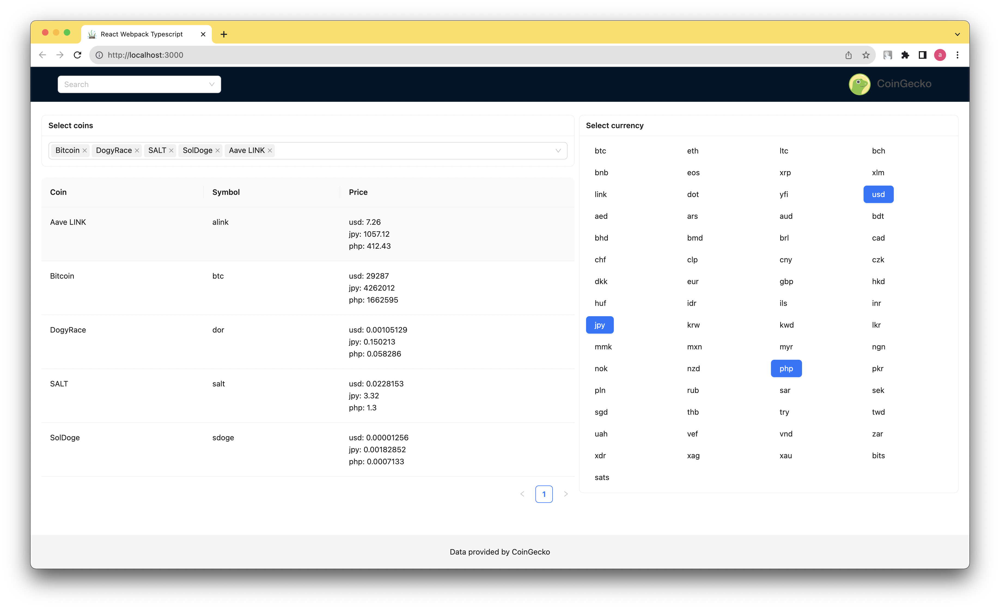
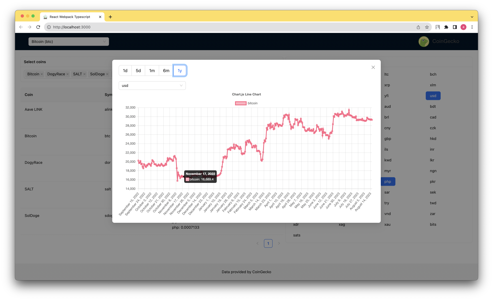

# Crypto Price Viewer

## Preview
https://64dbb849f709ab1189c69b04--genuine-rugelach-aba10a.netlify.app/

## Getting Started

To run the Crypto Price Viewer application locally, follow these steps:

- Clone the repository: git clone https://github.com/sokoloveugene/currency
- Navigate to the project directory:
- Install dependencies: npm install
- Start the development server: npm start
- Application will be available at http://localhost:8080

## Build & serve

- Build optimized bundle: npm run build
- Run comand to serve optimized application: npm run serve
- Application will be available at http://localhost:3000

## Main Features

- View Crypto Currency Prices: Stay updated with real-time cryptocurrency prices from various sources.
- Select Multiple Crypto Currencies: Choose and track the cryptocurrencies that interest you. Monitor their prices, changes, and trends.
- Multiple Currencies: Besides crypto-to-crypto comparisons, you can also view prices in multiple fiat currencies, enhancing your market analysis.
- Prices are automatically refreshed every minute.
- Fallback Mechanism: In case the API service is unavailable, the app seamlessly switches to a fallback mechanism, ensuring a smoother user experience.
- Interactive Price Charts: Dive deeper into historical data with interactive charts displaying price trends over different time frames: 1 day, 5 days, 1 month, and 1 year. (Click name of the coin from tabel OR search from header)
- Persistent Selections: Your selected cryptocurrencies and preferred settings are automatically saved in the browser's local storage, so you don't lose your preferences between sessions.
- Dependency Injection: The application leverages the power of dependency injection to maintain a clean and modular codebase, making it easier to manage and scale.

## Technologies Used

- MobX: MobX is employed for efficient state management, ensuring seamless data synchronization across the application.
- Ant Design: The UI components from Ant Design provide a polished and user-friendly interface, enhancing the overall user experience.
- BottleJS: The usage of BottleJS enables dependency injection, promoting modularity and maintainability within the application's architecture.
- Chart.js: Interactive and visually appealing charts powered by Chart.js offer a comprehensive view of cryptocurrency price trends.

    

    

